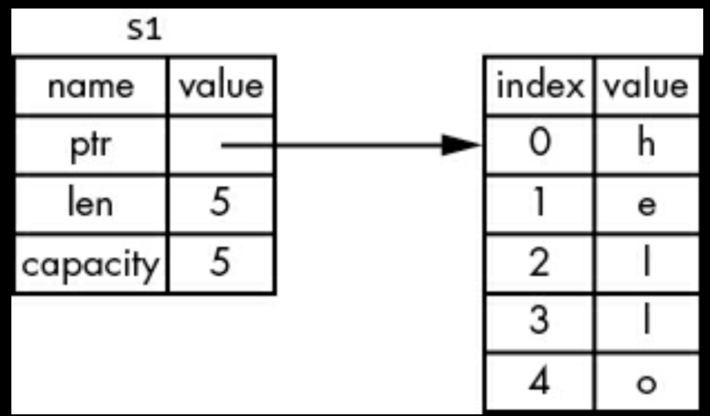
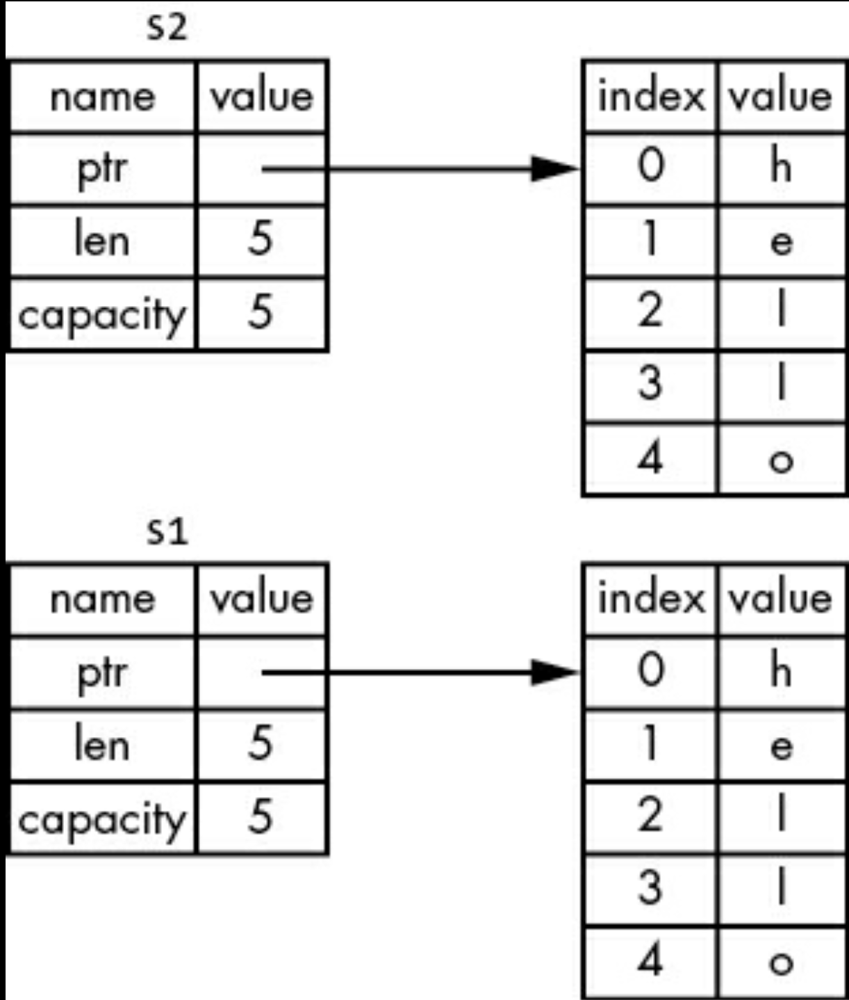

# Ownership Explained
<!-- toc -->

Ownership is a set of rules that govern how a Rust program manages memory. All programs have to manage the way they use a computer’s memory while running. Some languages have garbage collection that regularly looks for no-longer-used memory as the program runs; in other languages, the programmer must explicitly allocate and free the memory. Rust uses a third approach: memory is managed through a system of ownership with a set of rules that the compiler checks. If any of the rules are violated, the program won’t compile. None of the features of ownership will slow down your program while it’s running.

## Ownership Rules

* Each value in Rust has an owner. 
* There can only be one owner at a time. 
* When the owner goes out of scope, the value will be dropped.

```rust
let s = "hello";
```

## Variable Scope

* When s comes into scope, it is valid. 
* It remains valid until it goes out of scope.

## The String Type

The types covered previously are of a known size, can be stored on the stack and popped off the stack when their scope is over, and can be quickly and trivially copied to make a new, independent instance if another part of code needs to use the same value in a different scope. But we want to look at data that is stored on the heap and explore how Rust knows when to clean up that data, and the String type is a great example.

We’ve already seen *string literals* (like the variable `s` above), where a string value is hardcoded into our program. String literals are convenient, but they aren’t suitable for every situation in which we may want to use text. One reason is that they’re immutable.

Rust has a second string type, *String*. This type manages data allocated on the heap and as such is able to store an amount of text that is unknown to us at compile time. You can create a *String* from a string literal using the from function:

```rust
let s = String::from("hello");
```

The double colon :: operator allows us to namespace this particular from function under the String type rather than using some sort of name like string_from.

```rust
let mut s = String::from("hello");

s.push_str(", world"); // push_str() appends a lieteral to a string

println!("{s}");
```

## Memory and Allocation

In the case of a string literal, we know the contents at compile time, so the text is hardcoded directly into the final executable. This is why string literals are fast and efficient. But these properties only come from the string literal’s immutability.

With the String type, in order to support a mutable, growable piece of text, we need to allocate an amount of memory on the heap, unknown at compile time, to hold the contents. This means: 

* The memory must be requested from the memory allocator at runtime. 
* We need a way of returning this memory to the allocator when we’re done with our String.

Rust takes a different path: the memory is automatically returned once the variable that owns it goes out of scope.

```rust
{
    let s = String::from("hello");
    // s is valid from this point forward

    // do whatever with s
} // this scope is now over and s is no longer valid
```

There is a natural point at which we can return the memory our String needs to the allocator: when `s` goes out of scope. When a variable goes out of scope, Rust calls a special function for us. This function is called `drop`, and it’s where the author of *String* can put the code to return the memory. Rust calls drop automatically at the closing curly bracket.

### Variables and Data Interacting with Move

A String is made up of three parts, shown on the left: a pointer to the memory that holds the contents of the string, a length, and a capacity. This group of data is stored on the stack. On the right is the memory on the heap that holds the contents.

```rust
let s1 = String::from("hello");
let s2 = s1;
```
<p align="center">

</p>

When we assign `s1` to `s2`, the String data is copied, meaning we copy the pointer, the length, and the capacity that are on the stack. We do not copy the data on the heap that the pointer refers to.

<p align="center">

</p>

The representation does not look like the picture below, which is what memory would look like if Rust instead copied the heap data as well. If Rust did this, the operation `s2 = s1` could be very expensive in terms of runtime performance if the data on the heap were large.

<p align="center">

</p>

Earlier, we said that when a variable goes out of scope, Rust automatically calls the drop function and cleans up the heap memory for that variable. But two images above shows both data pointers pointing to the same location. This is a problem: when `s2` and `s1` go out of scope, they will both try to free the same memory. This is known as a double free error and is one of the memory safety bugs we mentioned previously. Freeing memory twice can lead to memory corruption, which can potentially lead to security vulnerabilities. To ensure memory safety, after the line `let s2 = s1;`, Rust considers `s1` as no longer valid.

You should receive an error on the following code
```rust
let s1 = String::from("Hello");
let s2 = s1;

println!("{s1}, world");
```

If you’ve heard the terms shallow copy and deep copy while working with other languages, the concept of copying the pointer, length, and capacity without copying the data probably sounds like making a shallow copy. But because Rust also invalidates the first variable, instead of being called a shallow copy, it’s known as a move. In this example, we would say that `s1` was moved into `s2`.

<p align="center">

</p>

Rust will never automatically create “deep” copies of your data. Therefore, any automatic copying can be assumed to be inexpensive in terms of runtime performance.

### Variables and Data Interacting with Clone
If we do want to deeply copy the heap data of the String, not just the stack data, we can use a common method called `clone`.

```rust
let s1 = String::from("Hello");
let s2 = s1.clone();

println!("s1 = {s1}, s2 = {s2}");
```

When you see a call to `clone``, you know that some arbitrary code is being executed and that code may be expensive. It’s a visual indicator that something different is going on.

### Stack Only Data: Copy

```rust
let x = 5;
let y = x;

println!("x = {x}, y = {y}");
```

But this code seems to contradict what we just learned: we don’t have a call to `clone`, but `x` is still valid and wasn’t moved into `y`. The reason is that types such as integers that have a known size at compile time are stored entirely on the **stack**, so copies of the actual values are quick to make. That means there’s no reason we would want to prevent `x` from being valid after we create the variable `y`. In other words, there’s no difference between deep and shallow copying here, so calling clone wouldn’t do anything different from the usual shallow copying, and we can leave it out.

So, what types implement the `Copy` trait? You can check the documentation for the given type to be sure, but as a general rule, any group of simple scalar values can implement `Copy`, and nothing that requires allocation or is some form of resource can implement `Copy`. Here are some of the types that implement Copy:

* All the integer types, such as u32. 
* The Boolean type, bool, with values true and false. 
* All the floating-point types, such as f64. 
* The character type, char. 
* Tuples, if they only contain types that also implement Copy. For example, (i32, i32) implements Copy, but (i32, String) does not.

## Ownership and Functions

```rust
fn main() {
    let s = String::from("hello");  // s comes into scope

    takes_ownership(s);             // s's value moves into the function...
                                    // ... and so is no longer valid here

    let x = 5;                      // x comes into scope

    makes_copy(x);                  // x would move into the function,
                                    // but i32 is Copy, so it's okay to still
                                    // use x afterward

} // Here, x goes out of scope, then s. However, because s's value was moved,
  // nothing special happens.

fn takes_ownership(some_string: String) { // some_string comes into scope
    println!("{some_string}");
} // Here, some_string goes out of scope and `drop` is called. The backing
  // memory is freed.

fn makes_copy(some_integer: i32) { // some_integer comes into scope
    println!("{some_integer}");
} // Here, some_integer goes out of scope. Nothing special happens.
```
If we tried to use s after the call to takes_ownership, Rust would throw a compile-time error.

## Return Values and Scope
Returning values can also transfer ownership.

```rust
fn main() {
    let s1 = gives_ownership();         // gives_ownership moves its return
                                        // value into s1

    let s2 = String::from("hello");     // s2 comes into scope

    let s3 = takes_and_gives_back(s2);  // s2 is moved into
                                        // takes_and_gives_back, which also
                                        // moves its return value into s3
} // Here, s3 goes out of scope and is dropped. s2 was moved, so nothing
  // happens. s1 goes out of scope and is dropped.

fn gives_ownership() -> String {        // gives_ownership will move its
                                        // return value into the function
                                        // that calls it

    let some_string = String::from("yours"); // some_string comes into scope

    some_string                              // some_string is returned and
                                             // moves out to the calling
                                             // function
}

// This function takes a String and returns a String.
fn takes_and_gives_back(a_string: String) -> String { // a_string comes into
                                                      // scope

    a_string  // a_string is returned and moves out to the calling function
}
```

While this works, taking ownership and then returning ownership with every function is a bit tedious.

```rust
fn main() {
    let s1 = String::from("hello");

    let (s2, len) = calculate_length(s1);

    println!("The length of '{s2}' is {len}.");
}

fn calculate_length(s: String) -> (String, usize) {
    let length = s.len(); // len() returns the length of a String

    (s, length)
}
```

But this is too much ceremony and a lot of work for a concept that should be common. Luckily for us, Rust has a feature for using a value without transferring ownership, called references.